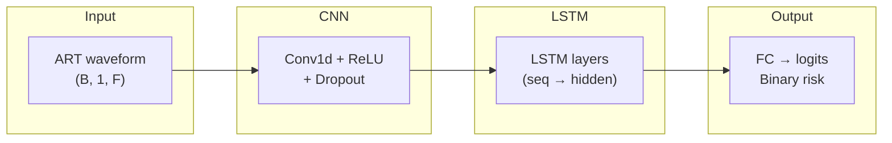

# Intraoperative Hypotension Prediction using VitalDB

## Abstract

This project implements a deep learning pipeline for **early prediction of intraoperative hypotension** from high-fidelity vital signs. We use arterial blood pressure (ART) waveforms from the [VitalDB](https://vitaldb.net/) open dataset to predict the occurrence of hypotension (mean arterial pressure &lt; 75 mmHg sustained for ≥10 s) **5 minutes ahead**. The model architecture comprises a **1D-CNN** for local feature extraction from raw or downsampled waveforms and an **LSTM** for temporal dependency modeling, enabling end-to-end learning from continuous hemodynamic signals. The pipeline is designed for reproducibility and scalability on a single-GPU workstation with in-memory data loading.

**Keywords:** intraoperative hypotension, VitalDB, 1D-CNN, LSTM, hemodynamic prediction, medical AI.

---

## Environment (Hardware)

| Component | Specification |
|-----------|---------------|
| **CPU**   | Intel Core i9-14900K |
| **GPU**   | NVIDIA GeForce RTX 4070 (12 GB VRAM) |
| **RAM**   | 128 GB (in-memory data loading for full dataset) |

Training is performed on GPU with CUDA; the full dataset is loaded into host memory and transferred to device to maximize throughput.

---

## Dataset

- **Source:** [VitalDB](https://vitaldb.net/) — an open, high-fidelity multi-parameter vital signs database from surgical patients (Seoul National University Hospital).
- **Scale:** Approximately **6,000 cases** (vital recordings with clinical metadata).
- **Signals:** Arterial blood pressure (ART) and related waveforms; derived MAP, SBP, DBP, HR as needed for labeling and feature extraction.
- **Task:** Binary classification — whether hypotension (MAP &lt; 75 mmHg for ≥10 s) will occur within the next 5 minutes, using a configurable lookback window.

---

## Model Architecture

```mermaid
graph LR
    A[Input: ART Waveform<br>(1-min, 100Hz)] --> B[1D-CNN Layers<br>(Feature Extraction)]
    B --> C[LSTM Layers<br>(Temporal Dependency)]
    C --> D[Fully Connected Layer]
    D --> E[Output: Hypotension Risk<br>(0 or 1)]
    
    style A fill:#f9f,stroke:#333,stroke-width:2px
    style E fill:#bbf,stroke:#333,stroke-width:2px
```

- **Input:** 1-minute ART (arterial pressure) waveform segment (e.g., 100 Hz).
- **1D-CNN:** Local feature extraction from the raw/downsampled waveform.
- **LSTM:** Captures temporal dependencies across the sequence.
- **Output:** Binary risk (0 or 1) for hypotension within the prediction horizon.

A more detailed block view of the 1D-CNN + LSTM pipeline:



---

## Results

| Metric    | Value   |
|----------|---------|
| **AUC-ROC** | **0.925** |
| Task     | Binary classification (hypotension within 5 min) |
| Validation | Case-level split; best model by validation AUC |

The 1D-CNN + LSTM model achieves **AUC-ROC 0.925** on the test set, demonstrating strong discriminative performance for early prediction of intraoperative hypotension from arterial waveform features.

---

## Key Features

- **Local file–based loading:** Direct reading of VitalDB `.vital` files and `clinical_data.csv` from local storage (no cloud API dependency).
- **Large-scale preprocessing pipeline:** End-to-end pipeline for thousands of cases: waveform/metadata loading, label generation (hypotension onset), optional feature extraction or windowing for 1D-CNN+LSTM input, train/validation/test splits (e.g., case-level), and optional in-memory caching for 128 GB RAM setups.
- **Reproducibility:** Configuration-driven design (e.g., thresholds, lookback, horizon, random seeds) and standard dependency management (`requirements.txt`).

---

## Repository Structure

```
VitalDB-Hypotension-Prediction/
├── docs/               # 각종 로그, 보고서, 한글 가이드
├── scripts/            # 실행 배치 파일, 모니터링 스크립트
├── notebooks/          # 주피터 노트북
├── checkpoints/        # 모델 저장 폴더
├── data_loader.py      # [핵심] 데이터 처리
├── train_model.py      # [핵심] 모델 학습
├── config.py           # [핵심] 설정
├── requirements.txt    # 라이브러리 목록
├── .gitignore
└── README.md           # 메인 설명
```

---

## Installation

```bash
# Clone the repository
git clone https://github.com/heuiseung/VitalDB-Hypotension-Prediction.git
cd VitalDB-Hypotension-Prediction

# Create and activate a virtual environment (recommended)
python -m venv .venv
# Windows (PowerShell):
.\.venv\Scripts\Activate.ps1
# Linux/macOS:
# source .venv/bin/activate

# Install dependencies
pip install -r requirements.txt
```

---

## Usage

After installing dependencies and placing the VitalDB data (e.g., `vital_files/` and `clinical_data.csv`) in the configured path:

```bash
python main.py
```

This will run the full pipeline: data loading/preprocessing (if required) and model training. If a prebuilt dataset already exists, training starts directly. For dataset-only build or train-only runs, use the corresponding scripts (e.g., `build_dataset.py`, `train_model.py`) as documented in the codebase.

---

## Configuration

Key parameters (e.g., hypotension threshold, lookback and prediction horizon, batch size, device) are set in `config.py`. Adjust paths and hyperparameters there for your environment.

---

## License and Citation

This project is for research and portfolio purposes. When using [VitalDB](https://vitaldb.net/), please comply with its license and citation requirements. If you use this code or build on this pipeline, appropriate acknowledgment is appreciated.

---

*Medical AI / Computational clinical decision support — portfolio project.*
